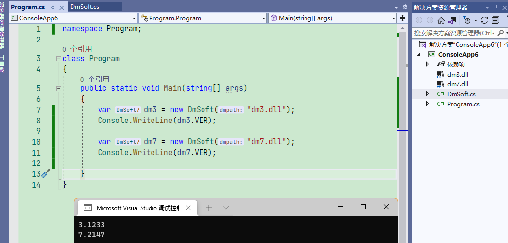

# xDM

> c# / c++ 使用大漠插件. 完成 类似 按键精灵的 功能.


# !!注意

低版本的大漠只能用32位的程序调用,

(最新的高版本应该可以64位,  暂时没试过)


现在新建C#和C++的程序, 

可能都是默认64位了. 

所以要手动修改程序的目标平台为x86.


# 效果图


# 免注册大漠

把dm.dll放在项目中, 直接使用,无需其他操作


[C# 免注册大漠, 免注册调用com组件类_韩俊俊的博客-CSDN博客](https://blog.csdn.net/black_bad1993/article/details/53906335)

[VC++ 免注册调用大漠插件_一株禾的博客-CSDN博客](https://blog.csdn.net/chuhe163/article/details/112745590)


> (3.1235+) 高版本的大漠也可以用官方提供的DmReg.dll  调用 SetDllPathA  进行注册 





# 代码注册

一定要将所有的初始化操作放在这个代码后面

```csharp
static void Main(string[] args)
{
    // 判断是否注册了大漠, 没有则执行命令注册 
    // (项目里新建一个"dll"文件夹,把dm.dll放进去,属性中选择"始终复制"))
    if (Type.GetTypeFromProgID("dm.dmsoft") == null)
    {
        // 执行cmd命令, 并打印输出 
        //  (搜索引擎随便找一个,
        // 一定要获取输出,否则还没等到注册成功,代码就继续执行了,就会初始化失败)
       ExcuteCommandOnBackgroudCaptureOutputStream("regsvr32 ./dll/dm.dll");
    }

    // 你的初始化dm代码
}
```


# 手动注册

1. 注册 大漠dll  到com (资源在 源码的 DLL 文件夹中)


2. 成功 提示


3. 验证是否注册成功 (列表中存在即可,不需要引用到项目中)


4.在 Visual Studio 中运行项目 查看结果

> 使用免费版  或者  填写 注册码  后  再运行

# 小实战

[https://github.com/xxxxue/war3-72bian](https://github.com/xxxxue/war3-72bian) : 只用到了一点点大漠 (其实代码中 windows api 可以替换成大漠的实现)

# 支持作者

如果这个开源项目 可以帮助到你,  你也可以请作者喝一杯咖啡。


